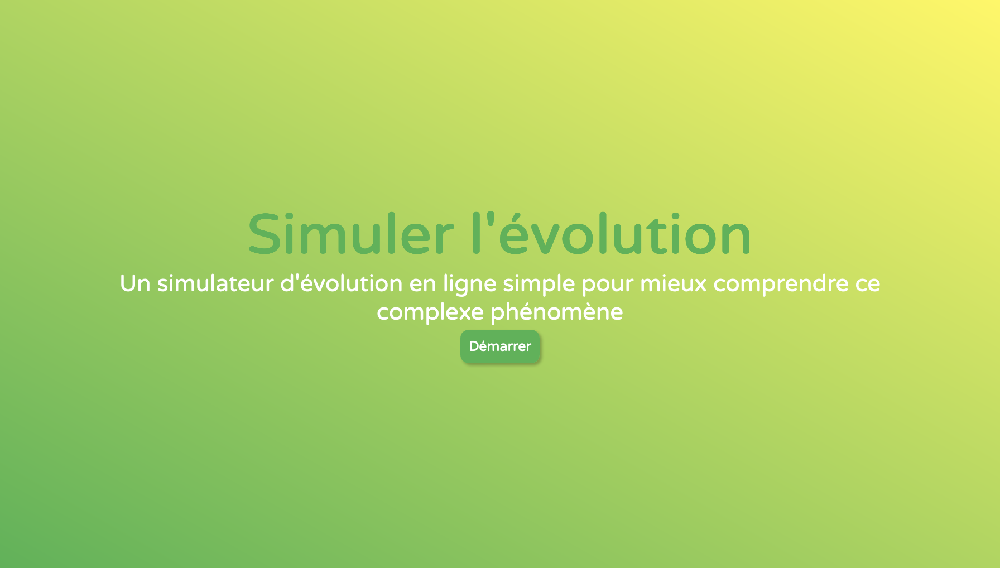
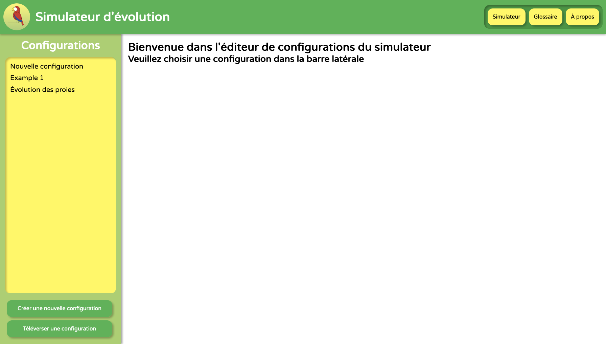
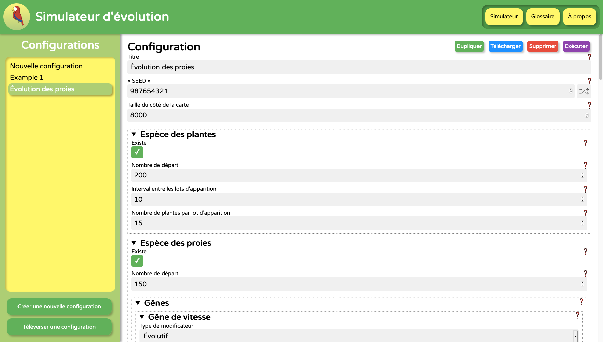
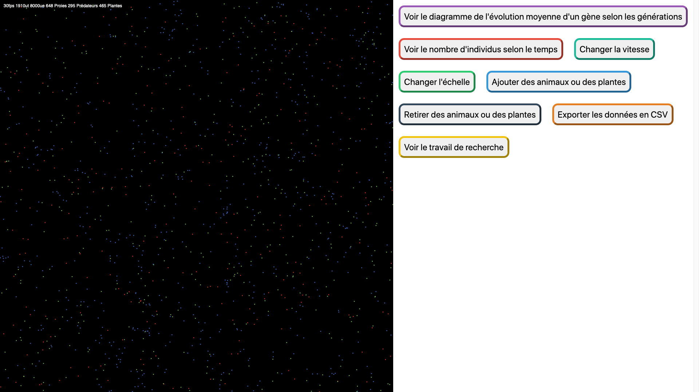
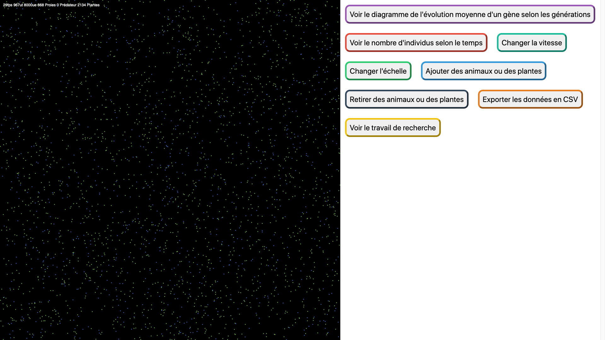

# Simulateur d'évolution

Un projet d'[Expo-Science](https://technoscience.ca/programmes/expo-sciences/) qui a pour but de simuler l'évolution naturelle selon la théorie de Charles Darwin

## Liens importants

- Le simulateur est accessible sur [expo.smartineau.me](https://expo.smartineau.me)
- Notre travail de recherche est disponible sur [Google Docs](https://docs.google.com/document/d/1-0XiVGQqNu3fPAFKN3vtxdBR2Abm4OA3ouX9kTg74Gk/edit?usp=sharing)
- Notre rapport est disponible sur [Google Docs](https://docs.google.com/document/d/1Aln9mbRdnBkItP4O2jbGNKjLoYmpsrAKU2wY7LRIqyI/edit?usp=sharing)

## Captures d'écran







## Documentation des champs de configuration

La documentation des champs de configuration est disponible [ici](https://expo.smartineau.me/documentation/glossaire)

## FAQ

La **f**oire **a**ux **q**uestions est disponible [ici](https://expo.smartineau.me/documentation/a-propos#faq)

## Déploiement

Une version publique du simulateur est disponible [ici](#), mais vous pouvez l'héberger vous-mêmes avec [Docker](https://www.docker.com/). Une image pré-construite est disponible sur **[Docker Hub](https://hub.docker.com/r/smartineau/simulateur-evolution-darwin)** et sur le **[Github Container Registry](https://github.com/users/Samuel-Martineau/packages/container/package/simulateur-evolution-darwin)**

## Développement

À noter que vous avez besoin de [Git](https://git-scm.com/), de [Node](https://nodejs.org/), de [NPM](https://www.npmjs.com/) et de [Yarn Classic](https://classic.yarnpkg.com/)

### Téléchargement du code source

Avant de développer l'éditeur de configurations, il faut d'abord cloner le dépôt

```bash
git clone https://github.com/Samuel-Martineau/Simulateur-Evolution-Darwin
cd Simulateur-Evolution-Darwin
```

### Le simulateur

Le simulateur en lui-même est séparé de l'éditeur de configurations et est situé dans le dossier [`simulator-core`](https://github.com/Samuel-Martineau/Simulateur-Evolution-Darwin/tree/v2/simulator-core)  
Avant de pouvoir travailler dessus, il vous faut installer ses dépendances

```bash
cd simulator-core
npm install
```

Vous pouvez par la suite le compiler pour la production via `npm run prod` ou pour le développement via `npm run dev`

### L'éditeur de configurations

Avant de travailler sur l'éditeur de configuration, vous devez compiler le simulateur pour la production  
Ensuite, vous devez installer ses dépendances

```bash
cd ..
yarn
```

Par la suite, vous pouvez le compiler pour la production via `yarn build` ou pour le développement via `yarn dev`

## License

[MIT](https://github.com/Samuel-Martineau/Simulateur-Evolution-Darwin/v2/master/LICENSE)
